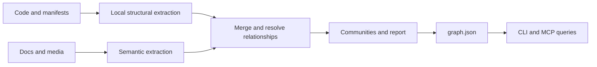

Graphify builds a map of your project and saves it as files. It connects code structure, document concepts, and source references without an embedding index or vector database.

## Extract structure

The code pipeline uses tree-sitter and specialized extractors to identify functions, classes, imports, calls, and other relationships. Parsing happens locally and does not require an LLM. Some formats use dedicated or heuristic parsers, so support differs by language and construct.

SQL and Terraform have structural extractors too; their optional dependencies are listed in [supported inputs](/concepts/supported-inputs).

## Add semantic context

Documents, papers, images, and transcripts can contribute concepts and relationships through a model. The skill uses the assistant environment; `graphify extract` supports configured headless backends.

This is a separate data path. A local code parse does not send files to a model, but semantic extraction may send its input to the provider you select. [Local development](/guides/local-development) explains the choices.

## Resolve and merge

Graphify links references across files and combines fragments into one graph. An edge stores a relationship and a provenance label. Resolution can infer a connection from static evidence; `INFERRED` does **not** always mean an LLM created it.

## Find communities

Community detection groups densely connected nodes into subsystems. Graphify uses Leiden when the relevant dependency is available and falls back to NetworkX Louvain. Clustering is based on graph structure.

Community names can come from your assistant or a configured backend. Use `--no-label` with `cluster-only` when you want to avoid model-generated names.

## Query a compact map

`query` gathers related context, `path` follows a connection, and `explain` inspects one node. MCP exposes the same graph through structured tool calls. These operations retrieve graph evidence; the assistant can then use it to form an answer.

<Tip>A graph is a map of the code and evidence Graphify analyzed. Dynamic dispatch, generated code, missing inputs, and stale scans can leave gaps. Inspect source citations before relying on a relationship.</Tip>

  <a href="/troubleshooting" rel="prev" aria-label="Previous: Troubleshooting" className="group flex min-h-[112px] flex-col justify-center gap-3 rounded-xl border border-[#c7dbd0] !border-b-[#c7dbd0] bg-[#ffffff] px-6 py-5 text-[#062314] no-underline transition-colors hover:border-[#94b6a2] hover:!border-b-[#94b6a2] hover:bg-[#edf6f0] focus-visible:outline focus-visible:outline-2 focus-visible:outline-offset-4 focus-visible:outline-[#4dea9c] items-start text-left"><svg width="14" height="14" viewBox="0 0 24 24" fill="none" stroke="currentColor" strokeWidth="1.8" aria-hidden="true"><path d="M15 5l-7 7 7 7" /></svg>PreviousTroubleshooting</a>
  <a href="/concepts/provenance" rel="next" aria-label="Next: Edges and provenance" className="group flex min-h-[112px] flex-col justify-center gap-3 rounded-xl border border-[#c7dbd0] !border-b-[#c7dbd0] bg-[#ffffff] px-6 py-5 text-[#062314] no-underline transition-colors hover:border-[#94b6a2] hover:!border-b-[#94b6a2] hover:bg-[#edf6f0] focus-visible:outline focus-visible:outline-2 focus-visible:outline-offset-4 focus-visible:outline-[#4dea9c] items-end text-right sm:col-start-2">Next<svg width="14" height="14" viewBox="0 0 24 24" fill="none" stroke="currentColor" strokeWidth="1.8" aria-hidden="true"><path d="M9 5l7 7-7 7" /></svg>Edges and provenance</a>

